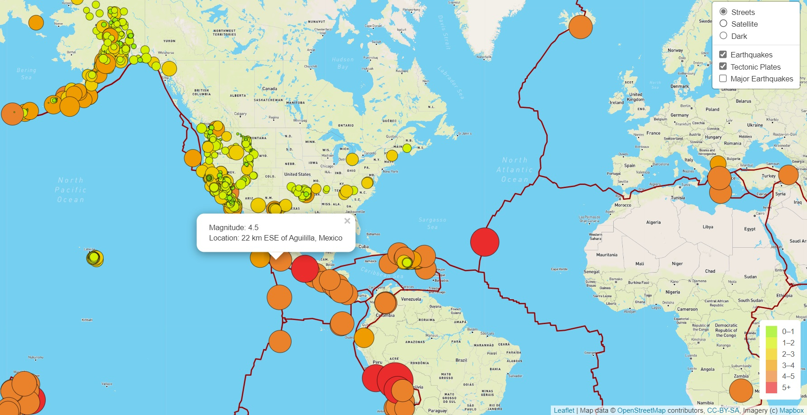

# Earthquake_Challenge
## Overview
This Project is about creating interactive maps using GeoJSON data. We have created earthquake map with two different maps and the earthquake overlay.
Further to it Basil and Sadhana would like to add the earthquake data in relation to the tectonic plates’ location on the earth, and they would like to see all the earthquakes with a magnitude greater than 4.5 on the map, and they would like to see the data on a third map.

For achieving this we need to deliver these in parts as follows
[Deliverable 1: Add Tectonic Plate Data](#Deliverable_1:_Add_Tectonic_Plate_Data)
Deliverable 2: Add Major Earthquake Data
Deliverable 3: Add an Additional Map

### Deliverable 1: Add Tectonic Plate Data
Here we should be able to see
* Satellite and Street map view options
* Tectonic Plates and Earthquakes ploted
* Legend to show the earthquake magnitude

 

*Click on image to view full image

