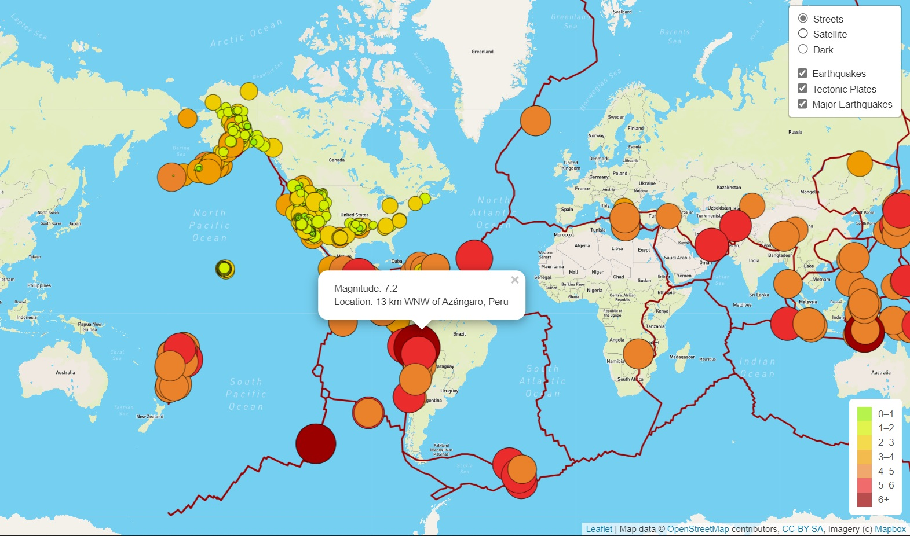
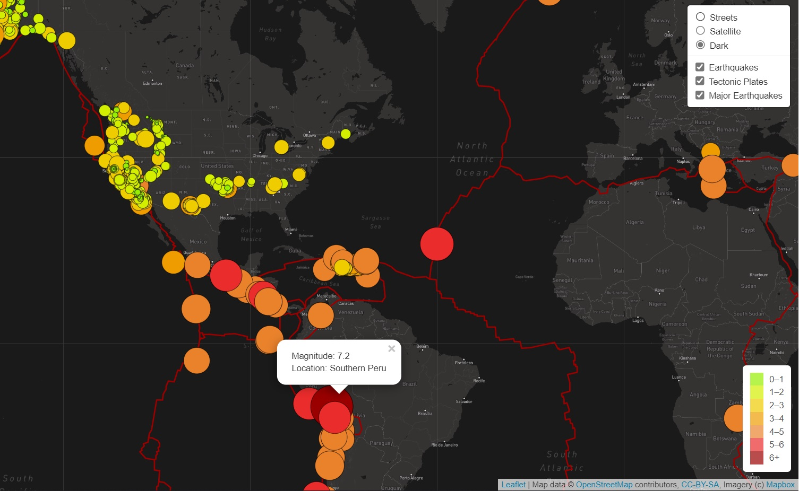
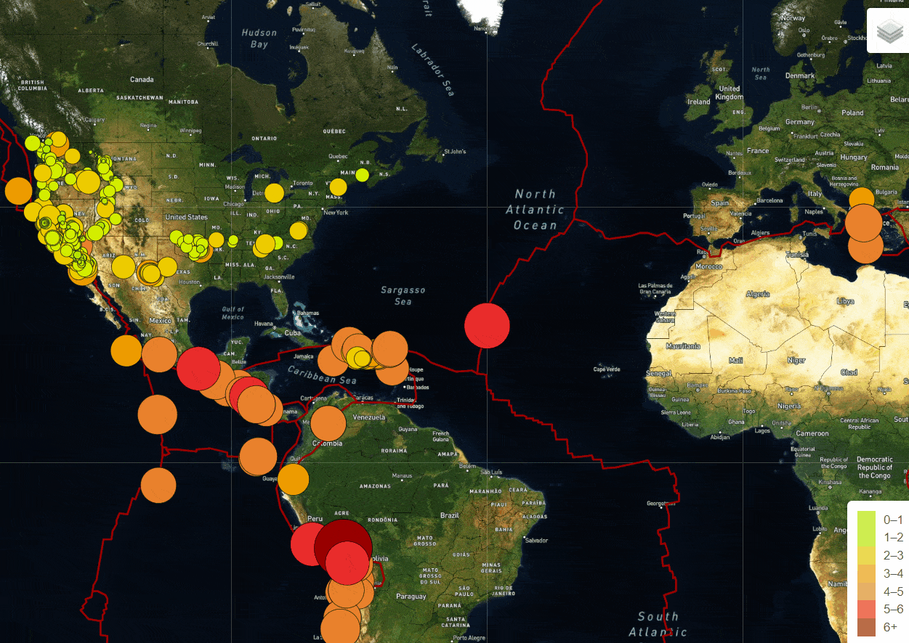

# Earthquake_Challenge
## Overview
This Project is about creating interactive maps using GeoJSON data. We have created earthquake map with two different maps and the earthquake overlay.
Further to it Basil and Sadhana would like to add the earthquake data in relation to the tectonic plates’ location on the earth, and they would like to see all the earthquakes with a magnitude greater than 4.5 on the map, and they would like to see the data on a third map.

For achieving this we need to deliver these in parts as follows

- [Deliverable 1: Add Tectonic Plate Data](#Deliverable_1:_Add_Tectonic_Plate_Data) 
- Deliverable 2: Add Major Earthquake Data 
- Deliverable 3: Add an Additional Map

### Deliverable 1: Add Tectonic Plate Data
Here we should be able to see
* Satellite and Street map view options
* Tectonic Plates and Earthquakes ploted
* Legend to show the earthquake magnitude

<p align="center"> </p>
Click on image to view good quality image


**Code to get above images:**
```python
// 1. Add a 2nd layer group for the tectonic plate data.
let allEarthquakes = new L.LayerGroup();
let tectonicPlates = new L.LayerGroup(); // adds 

// 2. Add a reference to the tectonic plates group to the overlays object.
let overlays = {
  "Earthquakes": allEarthquakes,
  "Tectonic Plates": tectonicPlates 
};


...

...

 let tectonicData = "https://raw.githubusercontent.com/fraxen/tectonicplates/master/GeoJSON/PB2002_boundaries.json";
  // Create a style for the lines.
  let myStyle = {
    color: "#990000",
    weight: 2
  }

  // 3. Use d3.json to make a call to get our Tectonic Plate geoJSON data.

  d3.json(tectonicData).then(function(data) {
  console.log(data);
  // Creating a GeoJSON layer with the retrieved data.
  L.geoJSON(data, {
    style: myStyle,
    onEachFeature: function(feature, layer) {    
      console.log(layer);
    }
  }).addTo(tectonicPlates);

  tectonicPlates.addTo(map);
});

```
### Deliverable 2: Add Major Earthquake Data 
Major Earthquake data is plotted with darker shades .
Added color code and legend for magnitude higher than 6

<p align="center"> </p>
Click on image to view good quality image


**Code**
```Python
// 1. Add a 2nd layer group for the tectonic plate data.
...
let majorEarthquakes = new L.LayerGroup();  //Major Earthquake

// 2. Add a reference to the tectonic plates group to the overlays object.
let overlays = {
  "Earthquakes": allEarthquakes,
  "Tectonic Plates": tectonicPlates,
  "Major Earthquakes": majorEarthquakes  //Major Earthquake
};

...
 const magnitudes = [0, 1, 2, 3, 4, 5, 6];
  const colors = [
    "#98ee00",
    "#d4ee00",
    "#eecc00",
    "#ee9c00",
    "#ea822c",
    "#ea2c2c",
    "#990000"    // added crimson red for higher magnitude
  ];


let earthquakeData = "https://earthquake.usgs.gov/earthquakes/feed/v1.0/summary/4.5_week.geojson";

 // 3. Use d3.json to make a call to get our major earthquake data.

 d3.json(earthquakeData).then(function(data) {
  console.log(data);
  // This function returns the style data for each of the earthquakes we plot on
  // the map. We pass the magnitude of the earthquake into two separate functions
  // to calculate the color and radius.
  function styleInfo(feature) {
    return {
      opacity: 1,
      fillOpacity: 1,
      fillColor: getColor(feature.properties.mag),
      color: "#000000",
      radius: getRadius(feature.properties.mag),
      stroke: true,
      weight: 0.5
    };
  }

  // This function determines the color of the marker based on the magnitude of the earthquake.
  function getColor(magnitude) {
    if (magnitude > 6) {
      return "#990000";
      }
      if (magnitude >= 5) {
        return "#ea2c2c";
      }
      return "#ea822c";       
}


  // This function determines the radius of the earthquake marker based on its magnitude.
  // Earthquakes with a magnitude of 0 were being plotted with the wrong radius.
  function getRadius(magnitude) {
    if (magnitude === 0) {
      return 1;
    }
    return magnitude * 4;
  }

   // Creating a GeoJSON layer with the retrieved data.
   L.geoJson(data, {
    // We turn each feature into a circleMarker on the map.
    pointToLayer: function(feature, latlng) {
        console.log(data);
        return L.circleMarker(latlng);
      },
    // We set the style for each circleMarker using our styleInfo function.
    style: styleInfo,
   // We create a popup for each circleMarker to display the magnitude and location of the earthquake
   //  after the marker has been created and styled.
   onEachFeature: function(feature, layer) {
    layer.bindPopup("Magnitude: " + feature.properties.mag + "<br>Location: " + feature.properties.place);
  }
}).addTo(majorEarthquakes);

// Then we add the earthquake layer to our map.
majorEarthquakes.addTo(map);

});

```

### Deliverable 3: Add an Additional Map
Added addtional Dark/Night view layer

<p align="center"> </p>
Click on image to view good quality image


**Code**
```python
let dark = L.tileLayer('https://api.mapbox.com/styles/v1/mapbox/dark-v9/tiles/{z}/{x}/{y}?access_token={accessToken}', {
	attribution: 'Map data &copy; <a href="https://www.openstreetmap.org/">OpenStreetMap</a> contributors, <a href="https://creativecommons.org/licenses/by-sa/2.0/">CC-BY-SA</a>, Imagery (c) <a href="https://www.mapbox.com/">Mapbox</a>',
	maxZoom: 18,
	accessToken: API_KEY
});

// Create a base layer that holds all three maps.
let baseMaps = {
  "Streets": streets,
  "Satellite": satelliteStreets,
   Dark: dark 
};
```

## Summary
A quick overview of all the functionality 
<p align="center"> </p>
[Click here](https://github.com/DeepaGheewala/Mapping_Earthquakes/blob/2f6c2c12adc6043e624b278e07567c9e53508468/Earthquake_Challenge/Images/Animation.gif) to view better quality gif - The colors are a bit changed in order to reduce the file size

## Code Files
1) [Index.html](https://github.com/DeepaGheewala/Mapping_Earthquakes/blob/3c43a2f0e1b76de190766e1fcbcf1afda63e8fb5/Earthquake_Challenge/index.html)
2) [style.css](https://github.com/DeepaGheewala/Mapping_Earthquakes/blob/3c43a2f0e1b76de190766e1fcbcf1afda63e8fb5/Earthquake_Challenge/static/css/style.css)
3) [Logic Code](https://github.com/DeepaGheewala/Mapping_Earthquakes/blob/3c43a2f0e1b76de190766e1fcbcf1afda63e8fb5/Earthquake_Challenge/static/js/challenge_logic.js)
